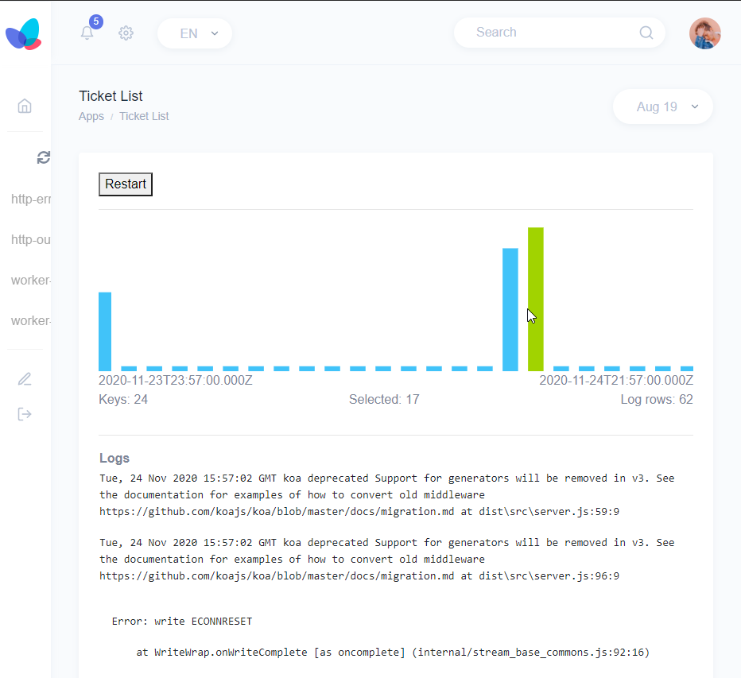

# koa backend, react frontend, everything TypeScript, WebSockets

[](https://travis-ci.com/spidgorny/lass)
[](https://codecov.io/gh/spidgorny/lass)
[](https://github.com/sindresorhus/xo)
[](https://github.com/prettier/prettier)
[](https://lass.js.org)
[](LICENSE)
[](https://npm.im/lass)

> This a quickstart boilerplate for an application that
> uses Koa as server, React as a frontend, connects them together
> using WebSockets and uses TypeScript everywhere.



Upon connecting the browser is sending it's userAgent to the server.

The time is being sent by Koa backend every second - React just updates it.

The [Send XXX] button sends a message to Koa backend - Koa displays it in the logs.

```bash
SockJS v0.3.21 bound to "/sock"
√  success   Listening to 761K7Y2:3000
GET /sock/info?t=1607002093916 2ms 200
GET /sock/243/jgko1fyi/websocket 3ms (unfinished)
Mozilla/5.0 (Windows NT 10.0; Win64; x64) AppleWebKit/537.36 (KHTML, like Gecko) Chrome/87.0.4280.88 Safari/537.36
XXX 0.1649358394494378
XXX 0.5709051519790933
```

## Table of Contents


## Install

[yarn][]:

```sh
yarn
```


## Usage

```
yarn run dev
```

## Todo

* [ ] https://github.com/intesso/connect-livereload maybe

## Contributors

Slawa

## License


##

[npm]: https://www.npmjs.com/

[yarn]: https://yarnpkg.com/
